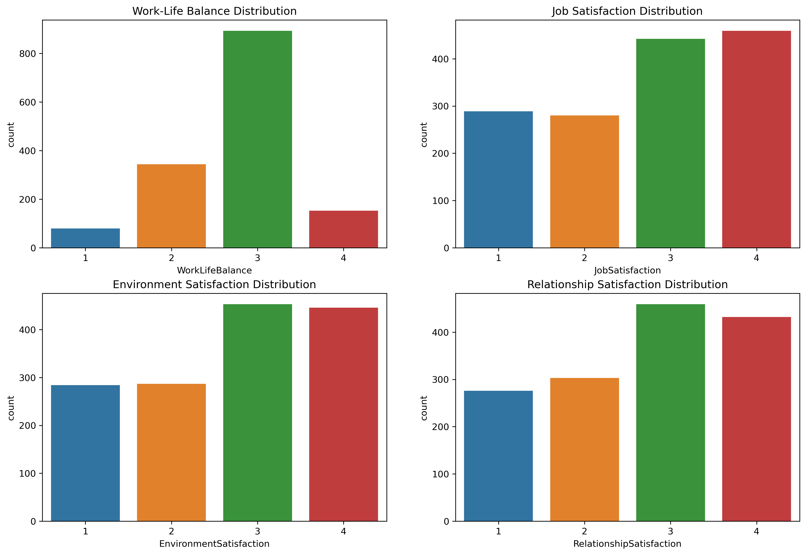
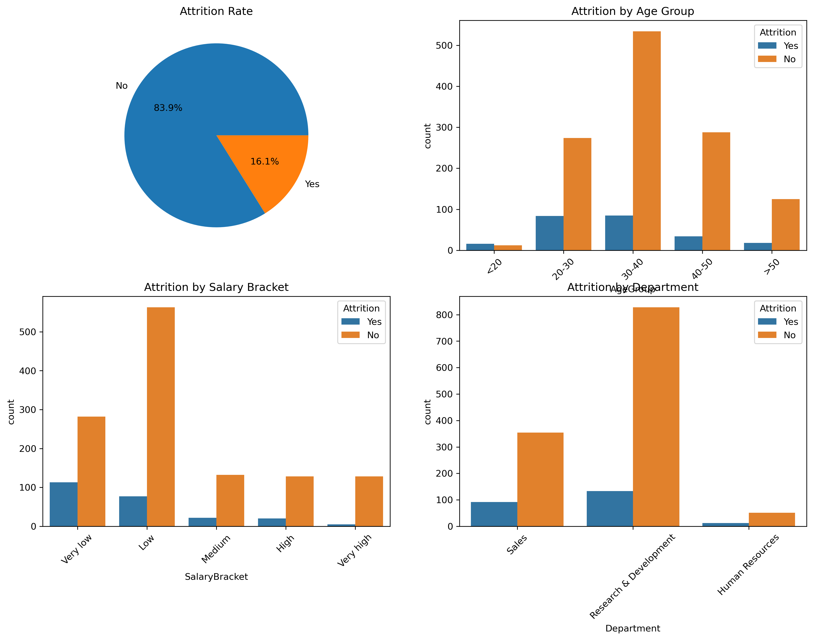

# IBM HR Analysis

## 1. Overview
This report analyzes IBM HR data obtained from [Kaggle: IBM HR Analytics Employee Attrition & Performance](https://www.kaggle.com/datasets/pavansubhasht/ibm-hr-analytics-attrition-dataset/data). The data includes both numerical and categorical variables. Statistical and data analysis techniques were applied to extract insights on employee demographics, attrition rates, salary distribution, and employee satisfaction. The complete analysis is available on [GitHub: IBM HR Data Analysis.](https://github.com/Mubarak-Monsuru/Python/blob/main/script/ibm_staff.ipynb)

## 2. Data Exploration and Processing
### 2.1 Data Cleaning
The initial steps involved data exploration and cleaning, including:
* Checking for duplicates and null values.
* Performing statistical analysis on numerical columns to determine minimum, maximum, standard deviation, and quartiles.
* Transforming numerical rating columns into categorical variables.
* Creating new categorical columns 'AgeGroup' and 'SalaryBracket' from the 'Age' and 'MonthlyIncome' columns, respectively.

### 2.2 Outlier Analysis
Outlier analysis was conducted and 8 columns are identified to contain outliers. Further analysis was conducted on 'MonthlyIncome' column to determine the data rows with monthly income as outliers, as well as the job roles with the outlying income and their departments. 

## 3. Data Analysis
### 3.1 Employee Demographics
Visualizations were created to depict the distribution of employee ages, genders, and marital statuses.

**Figure 1:** Employee Demographics

#### Observations:
* The largest employee population falls within the 30-40 age range, significantly higher than other age groups.
* Younger individuals (below 25) are underrepresented in the workforce.
* A decline is observed in the number of employees aged 50 and above.
* Males make up a larger proportion (60%) of the workforce compared to females (40%).
* A significant portion of employees are married (45.8%), followed by single (32%) and divorced (22.2%).

#### Recommendations:
* Implement training and mentoring programs for younger employees to build a strong succession pipeline.
* Consider offering relevant benefits and career growth opportunities to retain the dominant 30-40 age group.
* Develop initiatives aimed at improving gender diversity within the workforce.
* Offer benefits like family health insurance and childcare assistance to appeal to the married demographic.
* Implement flexible work arrangements or social engagement programs to support work-life balance for single employees.

### 3.2 Salary Analysis
Visualizations were used to understand salary distributions based on factors like job roles, years of experience, and education fields.

**Figure 2:** Salary Distributions

#### Observations:
* Most employees earn between $2,500 and $7,500 monthly, with a sharp decline in frequency as income surpasses $10,000.
* Outliers exist in the higher income ranges (e.g., $15,000–$20,000), potentially representing senior-level or highly specialized positions.
* Approximately 77% of employees earn less than $10,000 and 90% of employees earn less than approximately $12,534.37.
* High variability is observed in income across senior roles, indicating differences in experience, tenure, or performance-based pay.
* Executives, Directors, and Managers have the highest median incomes, while roles like Laboratory Technicians and Sales Representatives have lower incomes.
* Employees in Marketing earn higher median incomes compared to other fields.
* Human Resources personnel tend to have lower median incomes.
* Income generally increases with years of experience. A few high-income earners with fewer years of experience may represent specialized roles or rapid promotions.

#### Recommendations:
* Develop clear career progression plans that provide employees with pathways to higher-paying roles.
* Review compensation structures to ensure fairness within similar roles.
* Align hiring strategies with fields offering higher returns on investment.
* Implement mentorship programs to help employees with less experience transition into higher-earning roles.

### 3.3 Employee Satisfaction Analysis
Employee satisfaction was analyzed regarding work-life balance, relationships, environment, and job satisfaction. Satisfaction levels ranged from 1 (low) to 4 (high).

**Figure 3:** Satisfaction Analysis

#### Observations:
* The majority of employees report a moderate level of satisfaction with work-life balance.
* A smaller number report a low level of satisfaction with work-life balance.
* The highest number of employees report moderate to high levels of job satisfaction.
* A smaller number report low levels of job satisfaction.
* The majority of employees report satisfaction with their work environment.
* A smaller number report dissatisfaction with their work environment.
* Most employees report satisfaction with relationships with colleagues and supervisors.
* A minority group indicates dissatisfaction with their work relationships.

#### Recommendations:
* Enhance the work environment for employees who report low satisfaction.
* Implement initiatives such as team-building activities or mentorship programs for employees to develop stronger bonds with colleagues and supervisors.
* Offer resources and support to help employees manage their work-life balance. This could include flexible work arrangements, stress management workshops, or childcare assistance.
* Conduct regular employee satisfaction surveys to identify areas for improvement. This will help ensure that the company is taking steps to address employee concerns and maintain high levels of satisfaction.

### 3.4 Attrition Analysis
Attrition analysis was conducted to determine attritions based on factors such as salary bracket, age group, and department.

**Figure 4:** Attrition Analysis

#### Observations:
* The overall attrition rate is 16.1%. This means that approximately 16.1% of employees have left the company.
* Attrition appears to be highest among employees in the 30-40 age group and lowest among employees in the 20-30 age group.
* Attrition is highest among employees in the Low salary bracket and lowest among employees in the Very High salary bracket.
* Attrition is highest in the Research & Development department and lowest in the Human Resources department.

#### Recommendations:
* Focus on retention strategies and consider offering more opportunities for career advancement and development for employees in the 30-40 age group and the Research & Development department.
* Implement salary adjustments or other incentives to reduce attrition in lower salary brackets.
* Conduct employee satisfaction surveys and exit interviews to identify specific reasons for attrition and address them.