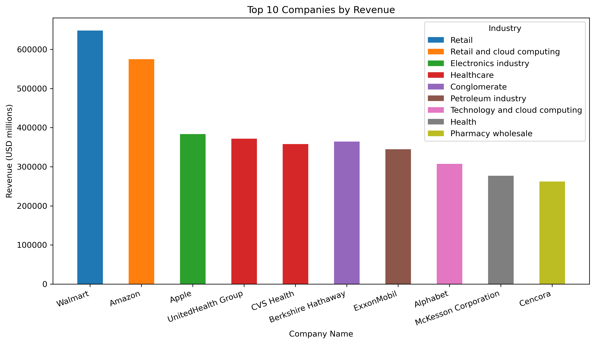
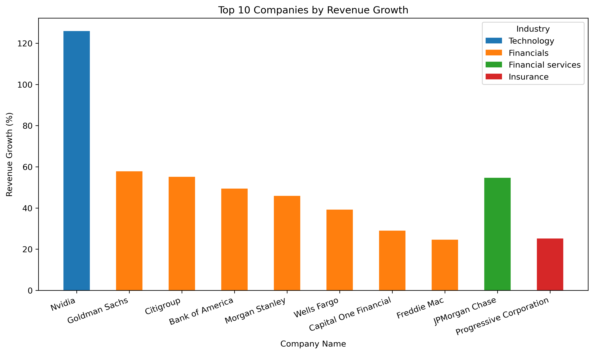
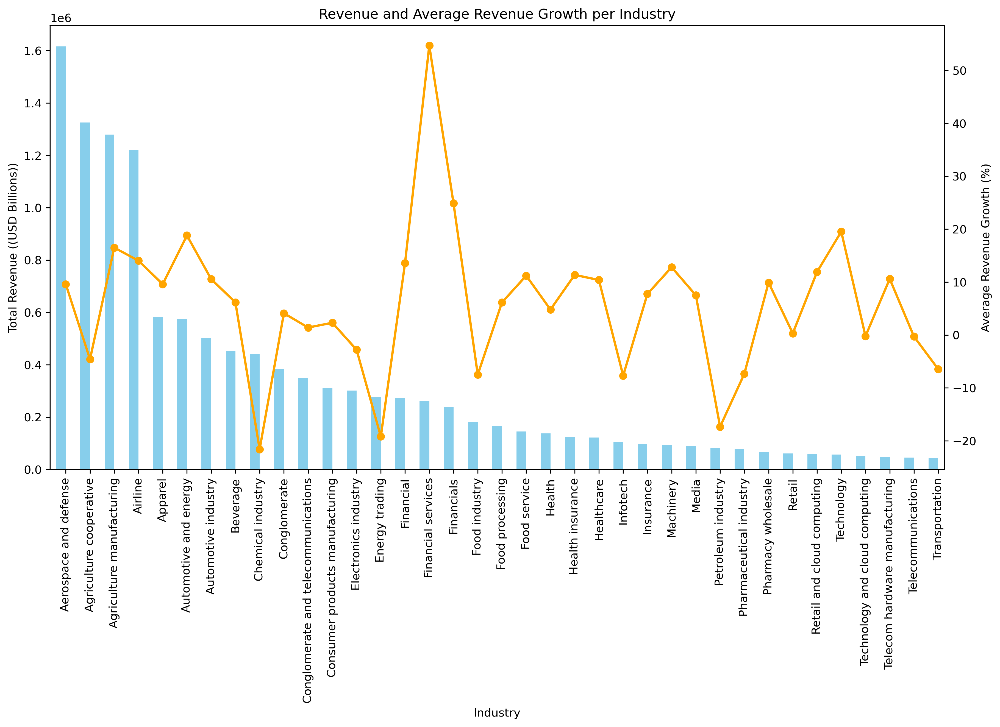
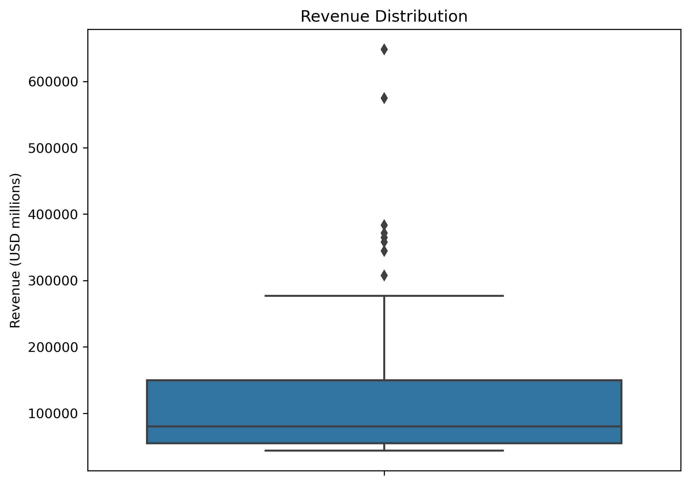
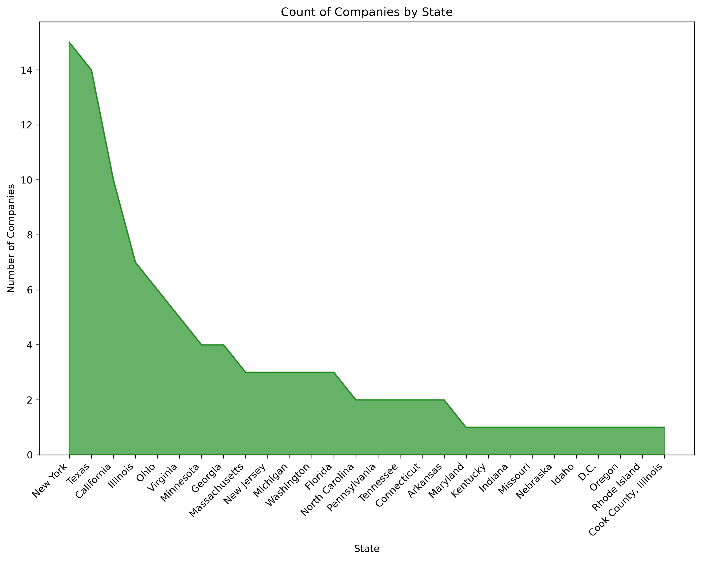
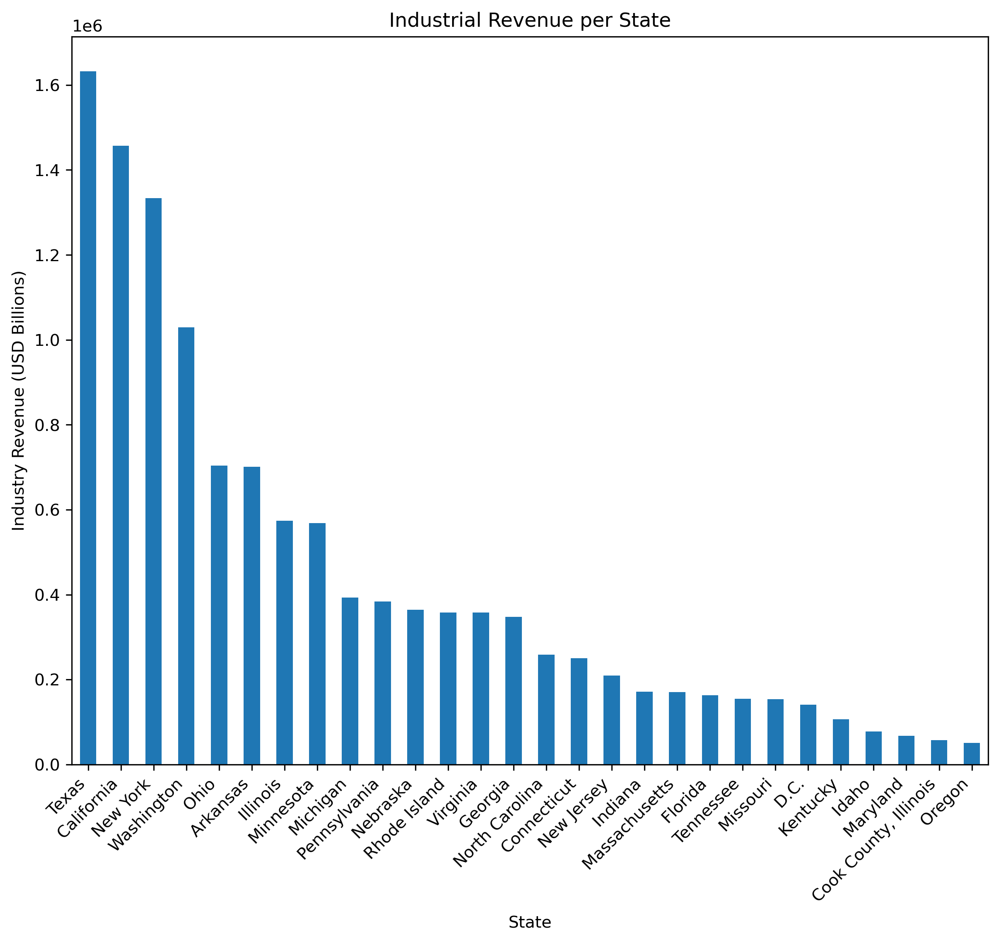

# Top 100 USA Companies by Revenue - 2024

## 1. Overview
This document presents the results of a project conducted to analyze data on the top 100 companies by revenue in the USA for 2024. The analysis includes web scraping, data processing, data aggregation, data visualization, and extracting pertinent insights. The complete analysis is available on [GitHub: Top 100 USA Companies 2024.](https://github.com/Mubarak-Monsuru/Python/blob/main/script/us_companies_revenue_2024.ipynb)

## 2. Web scrapping, data processing and data Aggregation
Data for this project was sourced from [Wikipedia: List of largest companies in the United States by revenue](https://en.wikipedia.org/wiki/List_of_largest_companies_in_the_United_States_by_revenue). The BeautifulSoup and requests libraries were used for web scraping, while pandas was employed to structure the data into a DataFrame.

Further processing and aggregation were performed to prepare the data for visualization. Special characters and certain symbols were removed from columns containing digits, and those columns were converted to either integers or floats. Additionally, the 'Headquarters' column was expanded into two separate columns: 'City' and 'State'.

For some visualizations, additional tables were created from the processed data:
* industry_revenue: Represents the sum of revenue per industry.
* industry_growth: Represents the average revenue growth (%) per industry.
* state_counts: Represents the count of top 100 companies in each state.
* revenue_state: Represents the total revenue generated by the top 100 companies in each state.

## 3. Data Visualization and insights

### 3.1 **Top 10 Companies by Revenue and Revenue growth**
   To showcase the top 10 companies based on revenue and revenue growth, clustered bar charts were created. These visualizations provide a preliminary perception of whether the largest companies by revenue also claim the top spots in revenue growth.

   
   **Figure 1:** Top 10 Companies by Revenue

   This chart demonstrates that the largest companies by revenue are not confined to a single industry but are spread across various sectors. Retail giants like Walmart and Amazon lead, while technology companies like Apple and Alphabet hold significant positions. The healthcare sector is also represented, indicating its crucial role in the economy. The diversity among the top 10 companies reflects a balanced economic distribution across different industries.

   
   **Figure 2:** Top 10 Companies by Revenue Growth

   This chart highlights the impressive revenue growth achieved by companies across various industries, with particular emphasis on the financial and technology sectors. Nvidia’s exceptional growth stands out, while financial institutions display strong, steady growth, underscoring the robustness of the financial sector. The presence of companies from diverse industries among the top 10 highlights the potential for high revenue growth across different economic sectors. It is noteworthy that the top 10 companies by revenue do not rank among the top 10 based on revenue growth.

### 3.2 **Revenue and Revenue growth**
   As an extension of the previous charts, it is relevant to assess whether industries with the highest revenue also lead in revenue growth. A combination chart is used to present this relationship.

   
   **Figure 3:** Relationship between Revenue and Revenue growth

   Industries with the highest total revenues do not necessarily have the highest average revenue growth percentages. while high total revenue industries are essential for the economy, industries with high average revenue growth are potentially more dynamic and offer more opportunities for rapid expansion or innovation. This distinction can be crucial for strategic planning, investment decisions, and market analysis.

### 3.3 **Revenue Distribution**
   A box plot was created to visually summarize the revenue distribution, highlighting the central tendency, variability, and the presence of any outliers in the data.
   
   
   **Figure 4:** Revenue Distribution

   Approximately 50% of the companies generate revenue between just below 50,000 (USD millions) and just above 100,000 (USD millions), indicating that the majority of companies fall within this range. The presence of multiple outliers above the upper whisker suggests that a few companies have very high revenues, significantly higher than the rest. The long upper whisker compared to the lower whisker indicates a wider spread in the higher revenue values, with fewer companies having very low revenues.

### 3.4 **Industrial Revenue by State**
   These companies operate in different states across the USA, with some states housing multiple top 100 companies. The following visualizations aim to observe the states with the largest populations of top 100 companies and the revenue generated by these companies.

   
   **Figure 5** Distribution of companies by state

   The area chart shows that the top 100 companies by revenue are heavily concentrated in a few key states, particularly New York, Texas, and California. These states likely offer favorable conditions for large corporations, such as access to capital, infrastructure, and talent. This distribution reflects the broader economic landscape of the United States, where a few states dominate but others also play important roles.

   
   **Figure 6** Industrial revenue by state

   The bar chart reveals that the industrial revenue generated by the top 100 companies is heavily concentrated in a few states, particularly Texas, California, and New York. These states are critical to the overall economic landscape of the U.S., but there is also a broad distribution of revenue contributions across many other states, reflecting a diverse economic base across the country.

## 4. Conclusion
The analysis reveals that companies or industries with higher revenues do not necessarily exhibit higher revenue growth. This observation highlights the dynamic potential of companies with relatively lower revenue to achieve significant growth in the coming years. By enhancing productivity and optimizing operations, these companies can capture a larger market share and potentially ascend to the ranks of the largest revenue generators.

This insight is crucial for investors seeking opportunities in companies that are poised for growth rather than just those with established market dominance. Investing in companies with strong growth potential, even if they currently have lower revenues, can yield substantial returns over time.

Moreover, the concentration of top companies in certain states underscores the importance of infrastructure, business-friendly policies, and access to capital and talent. States like New York, Texas, and California, which host the majority of these top companies, benefit from a virtuous cycle of investment and development. These states attract more investors, further fueling their economic growth and reinforcing their status as economic powerhouses.

Other states can take a cue from this and focus on developing the necessary infrastructure, creating favorable business environments, and attracting investments. By doing so, they can encourage the growth of local companies, attract top-tier businesses, and contribute to a more balanced economic distribution across the country.

Additionally, policymakers and economic planners can use these insights to identify sectors with high growth potential and develop targeted strategies to support their expansion. This approach can foster innovation, stimulate job creation, and enhance the overall competitiveness of the U.S. economy on the global stage.